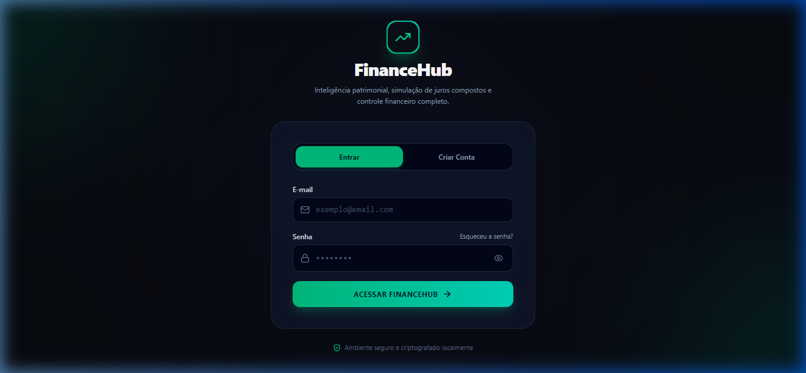
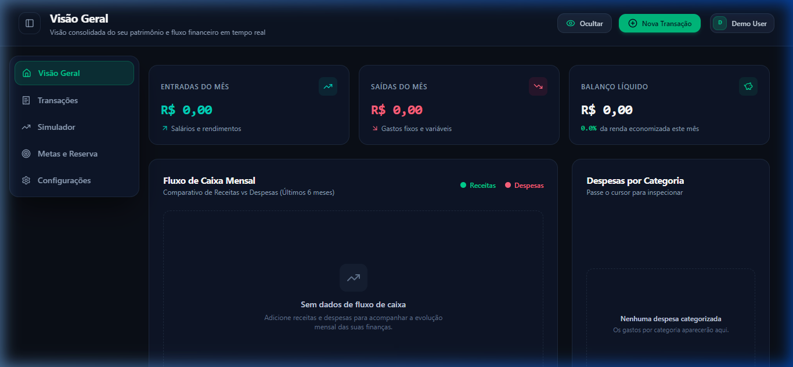
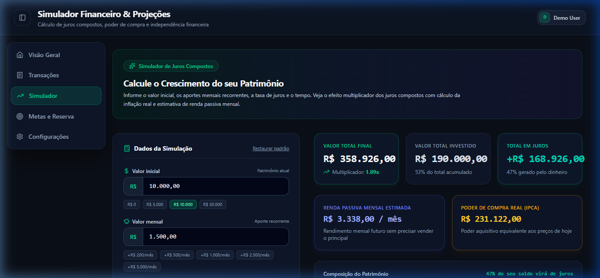
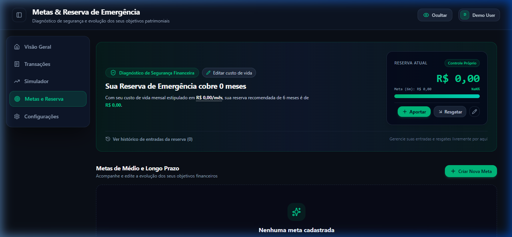
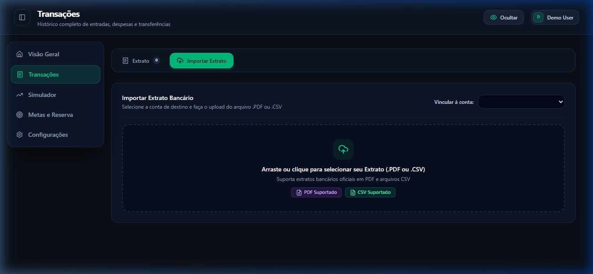
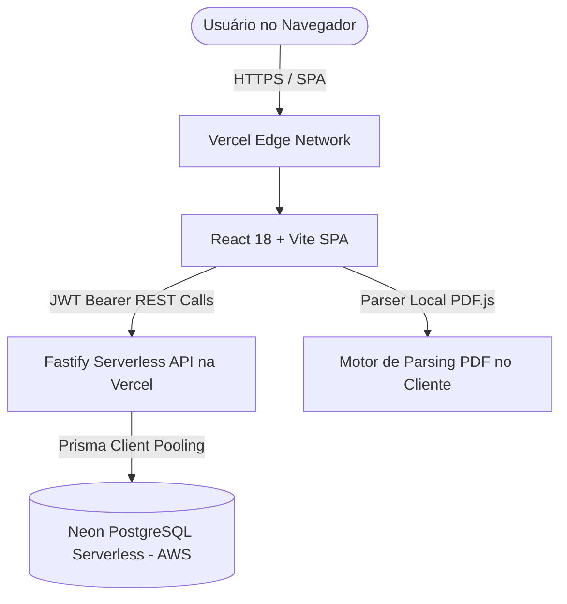

# FinanceHub 💰 | Plataforma de Inteligência Financeira & Gestão Patrimonial

<p align="center">
  
  
  
  
  
  
  
  
</p>

---

## 🚀 Demonstração em Produção

A aplicação e sua infraestrutura estão ativas e integradas na nuvem:

* 🌐 **Frontend Oficial:** [https://finance-green-six.vercel.app](https://finance-green-six.vercel.app/)
* ⚡ **API REST Backend:** [https://finance-api-forja5.vercel.app](https://finance-api-forja5.vercel.app/)
* 🗄️ **Banco de Dados em Nuvem:** [Neon.tech](https://neon.tech/) (PostgreSQL Serverless - AWS us-east-2)

> **Credenciais de Teste / Demonstração:**
> * **E-mail:** `demo@financehub.com`
> * **Senha:** `123456`
> *(Ou crie uma nova conta instantaneamente com nome, e-mail e senha)*

---

## 📖 Sobre o Projeto

O **FinanceHub** é uma solução completa de planejamento e governança financeira pessoal. Construído com arquitetura fullstack desacoplada e padrões modernos de engenharia de software, o sistema combina um design ultra-responsivo com uma API de alto rendimento capaz de calcular fluxos de caixa, projeções de juros compostos em tempo real e conciliação bancária automatizada.

---

## 📸 Demonstração Visual das Funcionalidades

### 1. Autenticação Segura & Design Premium
Acesso rápido via credenciais seguras (JWT + Bcrypt), modo de privacidade com ocultação de saldos em tela e alternância fluida entre cadastro e login.


---

### 2. Visão Geral (Dashboard Consolidado)
Central de controle patrimonial com métricas de entradas, despesas, balanço líquido, distribuição por contas bancárias e gráfico histórico de fluxo de caixa.


---

### 3. Gestão Completa de Transações
Livro-razão financeiro com filtros inteligentes por período, tipo de transação, conta, categoria e busca textual, além de recálculo atômico dos saldos bancários.


---

### 4. Simulador Financeiro & Projeções Patrimoniais
Motor matemático de cálculo de juros compostos adaptativo, contemplando aportes mensais, poder de compra com desconto de inflação e estimativa de renda passiva mensal.


---

### 5. Metas Patrimoniais & Diagnóstico de Emergência
Acompanhamento visual da evolução de objetivos financeiros e cálculo automático da saúde da **Reserva de Emergência** baseado na média real de gastos mensais.


---

### 6. Conciliação Inteligente de Extratos Bancários (PDF & CSV)
Parser inteligente capaz de extrair lançamentos de extratos bancários (Nubank, Inter, Itaú, Bradesco, etc.) e aplicar autoclassificação heurística por inteligência de categorias.


---

## 🏛️ Arquitetura do Sistema

O projeto adota uma **Arquitetura Fullstack Desacoplada (Decoupled Client-Server)** com hospedagem serverless de alto desempenho:



### 💎 Esclarecimento sobre o Banco de Dados (PostgreSQL vs SQLite)
Durante as etapas iniciais de prototipagem, utilizou-se SQLite em arquivo local temporário. No entanto, como a infraestrutura serverless da **Vercel** opera com containers de sistema de arquivos efêmero (*read-only*), **o projeto foi migrado e consolidado definitivamente para PostgreSQL Serverless no Neon.tech**:
1. **Conformidade ACID e Persistência na Nuvem:** Todos os registros de usuários, contas, categorias, transações e metas residem em instâncias gerenciadas na AWS (us-east-2).
2. **Connection Pooling Nativo:** Permite que as Serverless Functions da Vercel escalem sob demanda sem sobrecarregar o número de conexões simultâneas do PostgreSQL.
3. **Autenticação Desacoplada e Ilimitada:** A validação é gerenciada pela própria API com tokens JWT e hash Bcrypt, sem depender de cotas restritivas de envio de e-mails de serviços externos.

---

## 🛠️ Stack Tecnológica

### Frontend:
* **Framework:** [React 18](https://react.dev/) com [TypeScript](https://www.typescriptlang.org/)
* **Bundler & Build Tool:** [Vite](https://vitejs.dev/)
* **Estilização:** TailwindCSS & CSS Moderno (Glassmorphism, Dark Theme, Micro-animações)
* **Iconografia:** [Lucide React](https://lucide.dev/)
* **Processamento de Documentos:** [PDF.js](https://mozilla.github.io/pdf.js/) para leitura de extratos bancários direto no cliente

### Backend:
* **Servidor HTTP:** [Fastify 5](https://fastify.dev/) (arquitetura assíncrona com suporte a Serverless)
* **ORM:** [Prisma 6.4](https://www.prisma.io/)
* **Banco de Dados:** [Neon PostgreSQL](https://neon.tech/)
* **Validação:** [Zod](https://zod.dev/)
* **Segurança:** `@fastify/jwt` & `bcryptjs`
* **Parser de Extratos:** `csv-parse` com heurísticas de autoclassificação bancária

---

## 💻 Como Executar Localmente

### Pré-requisitos
* Node.js v20+ ou v24+
* Gerenciador de pacotes `npm` ou `pnpm`

### 1. Clonar os repositórios
```bash
# Repositório Frontend
git clone https://github.com/Crvlzin/Finance.git

# Repositório Backend
git clone https://github.com/Crvlzin/finance-api.git
```

### 2. Rodar o Backend (`finance-api`)
```bash
cd finance-api
npm install

# Copie e configure o arquivo .env
cp .env.example .env

# Sincronizar o banco de dados e popular dados iniciais
npx prisma db push
npm run seed

# Iniciar servidor em desenvolvimento (porta 3333)
npm run dev
```

### 3. Rodar o Frontend (`Finance/frontend`)
```bash
cd Finance/frontend
npm install

# Iniciar servidor Vite (porta 5173)
npm run dev
```

Acesse no navegador: `http://localhost:5173`

---

## 📄 Licença

Distribuído sob a licença MIT. Consulte `LICENSE` para mais detalhes.

---

<p align="center">
  Desenvolvido com foco em excelência técnica, arquitetura limpa e performance por <b>Gabriel Ferreira</b>.
</p>
